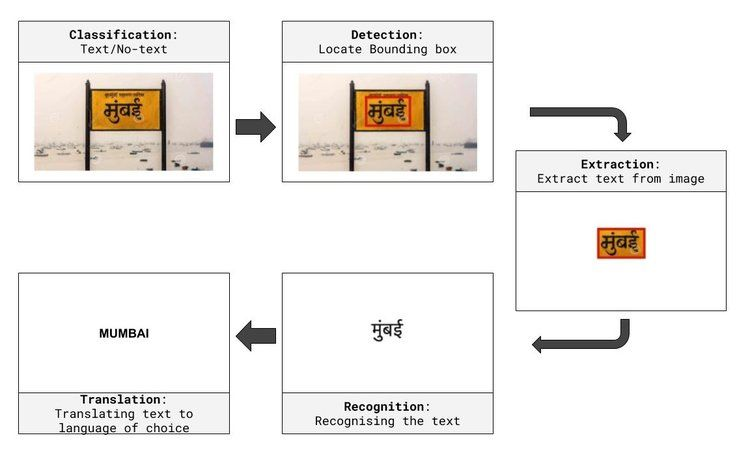

# **CS725: Foundations of Machine Learning**

This repository contains all the coursework done as part of **CS725 – Foundations of Machine Learning** at **IIT Bombay**, under the guidance of **Prof. Preeti Jyothi**.

It includes:

* **Assignments**: Hands-on coding tasks on topics such as Numpy programming, Linear Regression, Neural Networks, Explainability, Optimization, and Convolutions.
* **Project**: *SignboardOCR – Multilingual Signboard Detection and Transliteration*.

---

## **Assignments Overview**

### **[Assignment 1](Assignments/Assignment 1/Asignment_1.pdf)**

Focuses on building fundamental machine learning skills using Python and NumPy, and implementing regression models:

1. **NumPy Basics**:

   * Simulate and visualize coin toss experiments.
   * Matrix and tensor manipulations without loops.
2. **Linear Regression**:

   * Closed-form solution.
   * Batch Gradient Descent implementation with visualizations.
   * Basis functions for non-linear regression ("Smiling Joker").
3. **Kaggle Competition**:

   * Sentiment prediction from high-dimensional features using linear regression.

---

### **[Assignment 2](Assignments/Assignment 2/Asignment_2.pdf)**

Covers neural networks, explainability, optimizers, and convolution operations:

1. **Feedforward Neural Network**:

   * From-scratch implementation with multiple activation functions.
   * Backpropagation and gradient-based optimization.
2. **Explainability**:

   * Design minimal neural architectures for perfect separability on toy datasets, with neuron-level explanations.
3. **Optimizer Comparison**:

   * Vanilla GD, exponentially decaying LR, GD with momentum, and Adam.
4. **Convolutions**:

   * Implement 1D and 2D convolution from scratch.
   * Edge detection, noise removal, Gaussian blur, and unsharp masking.
5. **Extra Credit Kaggle Competition**:

   * Classification from ImageNet-derived features.

---

### **SignboardOCR: Multilingual Signboard Detection and Transliteration**

This project, developed as part of the CS725 Foundations of Machine Learning (FML) course, implements a custom pipeline for Optical Character Recognition (OCR) and transliteration. The system detects text in images of signboards, extracts text regions, recognizes Hindi text, and transliterates it into English using a deep learning-based encoder-decoder architecture.

---

## **Objective**

The primary objective of this project is to build a multilingual OCR pipeline tailored for detecting and processing text on signboards, especially focusing on Hindi text transliteration into English. This system integrates computer vision and natural language processing (NLP) techniques for end-to-end text recognition and translation.

---

---

## **Key Components**

### **1. Text Detection**

- **Model**: Faster R-CNN with ResNet-50 backbone.
- **Purpose**: Detect regions of interest (text regions) in signboard images.
- **Details**:
  - Adapted for detecting text boxes in custom signboard datasets.
  - Bounding box coordinates are extracted for subsequent text recognition.

---

### **2. Text Recognition**

- **Library**: EasyOCR.
- **Purpose**: Recognize text within detected regions.
- **Details**:
  - Supports Hindi (`hi`) and English (`en`) scripts.
  - Used as a lightweight solution for extracting text directly from cropped bounding box images.
  - Recognized text is passed for transliteration if it belongs to the Hindi script.

---

### **3. Transliteration**

- **Dataset**: [Dakshina Dataset](https://storage.googleapis.com/gresearch/dakshina/).
- **Architecture**:
  - **Encoder**:
    - GRU-based sequence encoding.
    - Converts character-level Hindi input to embeddings.
  - **Attention Mechanism**:
    - Bahdanau attention for context-aware transliteration.
  - **Decoder**:
    - GRU-based character-level sequence generation in English.
    - Utilizes teacher forcing during training for improved convergence.

- **Training**:
  - Optimized using `NLLLoss` and Adam optimizers.
  - Trained on ~30 epochs, achieving transliteration accuracy between **85-89%** on the Dakshina test set.

---

## **System Architecture**

1. **Input**: Image containing multilingual text (e.g., signboards).
2. **Text Detection**: Identify bounding boxes around text regions.
3. **Text Recognition**: Extract Hindi and English text from cropped regions.
4. **Transliteration**: Convert Hindi text to English transliteration.
5. **Output**: Processed text in English with transliterations for Hindi components.

---

## **Models and Tools**

- **Computer Vision**:
  - Faster R-CNN: Text detection.
  - PIL and Matplotlib: Image processing and visualization.
- **Natural Language Processing**:
  - EasyOCR: Text recognition.
  - Attention-based Encoder-Decoder: Hindi-to-English transliteration.
- **Dataset**:
  - Custom signboard dataset for text detection.
  - Dakshina dataset for transliteration training and validation.
- **Frameworks**:
  - PyTorch: Model development and training.
  - EasyOCR: OCR module.

---

## **Test Cases**

Simplified test cases and example outputs can be found in the file: [**Test Cases**](Project/TestCases.pdf).

---

## **Contributors**

- **Sakshi Pandey** - [sakshipandey@cse.iitb.ac.in](mailto:sakshipandey@cse.iitb.ac.in)
- **Amit Pandey** - [amitpandey@cse.iitb.ac.in](mailto:amitpandey@cse.iitb.ac.in)
- **Gunnu Sravani** - [gunnusravani@cse.iitb.ac.in](mailto:gunnusravani@cse.iitb.ac.in)
- **Garima Jain** - [jgarima@cse.iitb.ac.in](mailto:jgarima@cse.iitb.ac.in)
